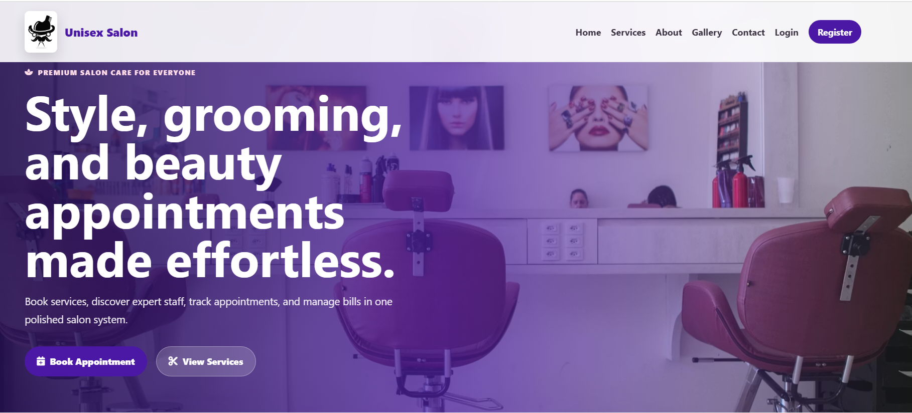
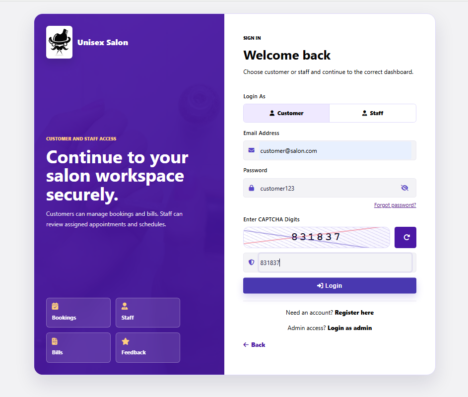
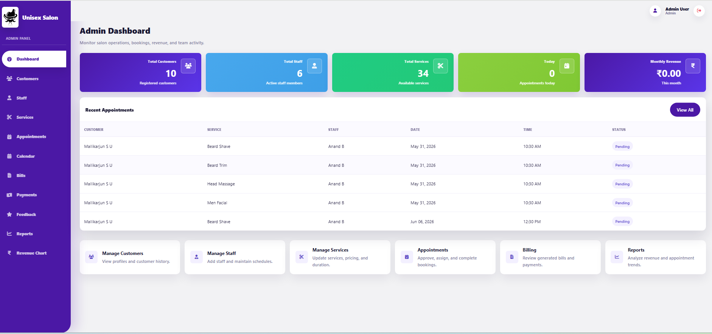
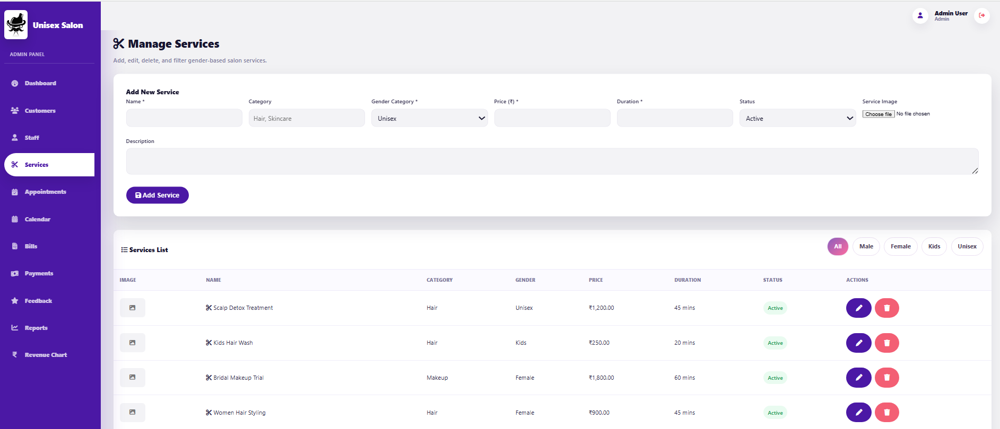
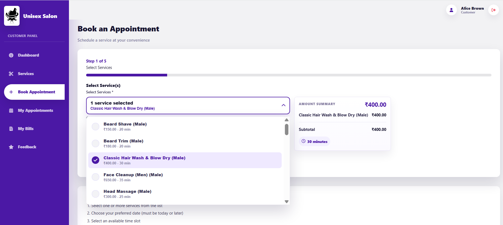
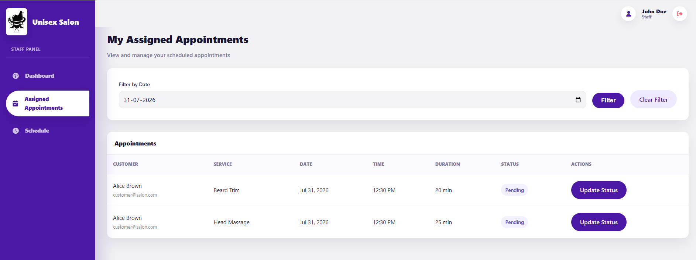
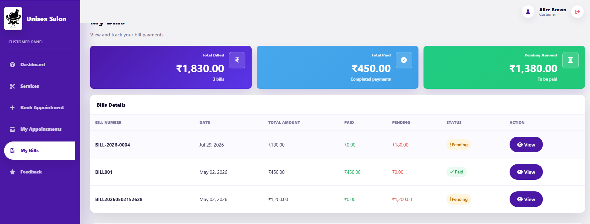
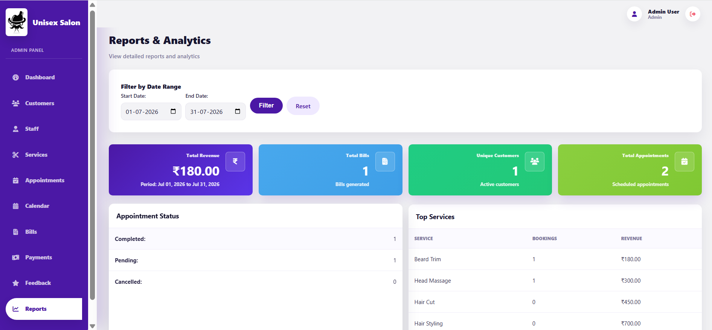

# Unisex Salon Management System

A PHP procedural salon management project for WAMP/XAMPP localhost. It includes role-based panels for Admin, Staff, and Customer users, gender-based services, AJAX appointment slots, automatic bill generation, pay-at-salon and Razorpay payment options, feedback, reports, and Chart.js revenue views.

## Features

- Modern responsive landing page with services, gallery, reviews, contact, and Font Awesome icons.
- Role-based login for Admin, Staff, and Customer.
- Login security: sessions, password hashing, CAPTCHA, attempt limiter, last login tracking.
- Customer registration with password strength meter, match checker, generator, copy button, and checklist.
- Gender service categories: Male, Female, Kids, Unisex.
- Admin service add/edit/delete/filter with gender category.
- Customer service filtering by AJAX without page reload.
- Appointment booking with service, staff, date, time slot, and AJAX availability checks.
- Appointment statuses: Pending, Approved, Rejected, In Progress, Completed, Cancelled.
- Automatic bill generation when appointment becomes Completed.
- Payment options: customers can pay at salon or use Razorpay online payment after account keys are configured.
- Customer bill view and print/download through browser print.
- Admin reports and Chart.js revenue charts.

## Screenshots

### Landing Page


### Login


### Admin Dashboard


### Service Management


### Appointment Booking


### Staff Dashboard


### Billing and Payment


### Reports and Analytics


## Technologies

- PHP procedural
- MySQL / phpMyAdmin
- WAMP or XAMPP localhost
- HTML, CSS, JavaScript
- AJAX
- Font Awesome
- Chart.js

Razorpay integration is included. Add your Razorpay account keys in `config/razorpay.local.php` or environment variables before using online payments.

## Folder Structure

```text
unisex_salon_management/
|-- index.php
|-- login.php
|-- register.php
|-- logout.php
|-- profile.php
|-- config/db.php
|-- includes/auth.php
|-- includes/header.php
|-- includes/sidebar.php
|-- includes/footer.php
|-- includes/generate_bill.php
|-- assets/css/style.css
|-- assets/css/landing.css
|-- assets/js/main.js
|-- assets/js/ajax.js
|-- assets/js/landing.js
|-- admin/
|-- customer/
|-- staff/
|-- ajax/
|-- database/salon_db.sql
```

## Database Setup

1. Start WAMP/XAMPP Apache and MySQL.
2. Open phpMyAdmin: `http://localhost/phpmyadmin/`
3. Import `database/salon_db.sql`.
4. The dump creates the database automatically:
   `unisex_salon_db`

Database config is in `config/db.php`:

```php
DB_HOST = localhost
DB_USER = root
DB_PASSWORD = empty
DB_NAME = unisex_salon_db
```

## Run Locally

Place the project at:

```text
C:\wamp64\www\Salon_Project\unisex_salon_management\
```

Open:

```text
http://localhost/Salon_Project/unisex_salon_management/
```

The app detects the correct base URL automatically if the folder is served from another localhost path.

## Default Login Credentials

Admin:

```text
admin@salon.com
admin123
```

Staff:

```text
staff@salon.com
staff123
```

Customer:

```text
customer@salon.com
customer123
```

All passwords are stored with `password_hash()` and verified using `password_verify()`.

## Viva Explanation

- `config/db.php` stores database settings and shared helper functions.
- `includes/auth.php` manages sessions, role checking, CAPTCHA, login attempts, and secure redirects.
- `includes/generate_bill.php` creates a bill and bill item when an appointment is completed, marking Razorpay-paid bookings as paid automatically.
- Admin can manage customers, staff, services, appointments, bills, payments, feedback, reports, and charts.
- Customers can browse services by gender, book appointments, view appointment status, view/print bills, and submit feedback.
- Staff can view assigned appointments, daily schedule, and update appointment status.
- AJAX is used for gender-service filtering, time-slot checks, search, booking, and status updates.
- Payments support pay-at-salon records and Razorpay online payments after account keys are configured.

## Testing Checklist

- Home: `http://localhost/Salon_Project/unisex_salon_management/`
- Login: `http://localhost/Salon_Project/unisex_salon_management/login.php`
- Register: `http://localhost/Salon_Project/unisex_salon_management/register.php`
- Admin Dashboard: `admin/dashboard.php`
- Customer Services: `customer/services.php`
- Book Appointment: `customer/book_appointment.php`
- Staff Appointments: `staff/assigned_appointments.php`
- Bills: `admin/bills.php` and `customer/my_bills.php`

Mark an appointment as Completed to verify automatic bill generation.

## Demo Video Guide

Use `VIDEO_SCRIPT.md` for a step-by-step recording walkthrough.

Suggested video sections:
- Landing page and user login
- Customer service browsing and appointment booking
- Admin dashboard, appointment management, services, and reports
- Staff view and assigned appointments
- Billing and payment overview

Save your demo file as `salon-system-demo.mp4` and include it or a link to it in your GitHub repository.
