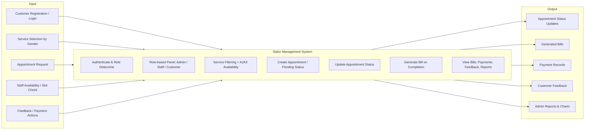

# Salon Management System Process Logic

```mermaid
flowchart LR
    subgraph INPUT[Input]
        I1[Customer Registration / Login]
        I2[Service Selection by Gender]
        I3[Appointment Request]
        I4[Staff Availability / Slot Check]
        I5[Feedback / Payment Actions]
    end

    subgraph PROCESS[Salon Management System]
        P1[Authenticate & Role Determine]
        P2[Role-based Panel: Admin / Staff / Customer]
        P3[Service Filtering + AJAX Availability]
        P4[Create Appointment / Pending Status]
        P5[Update Appointment Status]
        P6[Generate Bill on Completion]
        P7[View Bills, Payments, Feedback, Reports]
    end

    subgraph OUTPUT[Output]
        O1[Appointment Status Updates]
        O2[Generated Bills]
        O3[Payment Records]
        O4[Customer Feedback]
        O5[Admin Reports & Charts]
    end

    I1 --> PROCESS
    I2 --> PROCESS
    I3 --> PROCESS
    I4 --> PROCESS
    I5 --> PROCESS
    PROCESS --> O1
    PROCESS --> O2
    PROCESS --> O3
    PROCESS --> O4
    PROCESS --> O5
```
