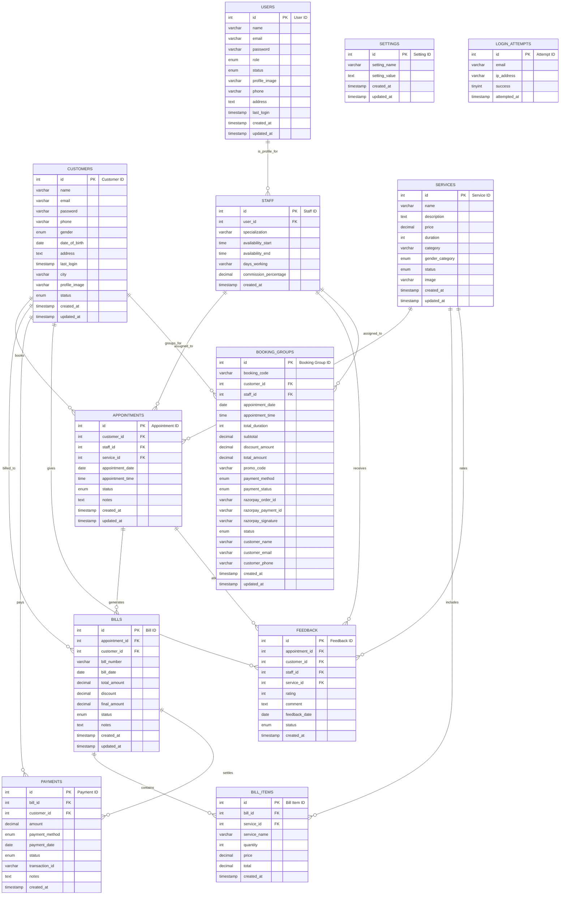

# Unisex Salon Management - ER Diagram

This diagram represents the database schema for the project, based on `database/salon_db.sql` and the booking table defined in `includes/booking.php`.

```mermaid
erDiagram
    CUSTOMERS {
        int id PK "Customer ID"
        varchar name
        varchar email
        varchar password
        varchar phone
        enum gender
        date date_of_birth
        text address
        timestamp last_login
        varchar city
        varchar profile_image
        enum status
        timestamp created_at
        timestamp updated_at
    }
    USERS {
        int id PK "User ID"
        varchar name
        varchar email
        varchar password
        enum role
        enum status
        varchar profile_image
        varchar phone
        text address
        timestamp last_login
        timestamp created_at
        timestamp updated_at
    }
    STAFF {
        int id PK "Staff ID"
        int user_id FK
        varchar specialization
        time availability_start
        time availability_end
        varchar days_working
        decimal commission_percentage
        timestamp created_at
    }
    SERVICES {
        int id PK "Service ID"
        varchar name
        text description
        decimal price
        int duration
        varchar category
        enum gender_category
        enum status
        varchar image
        timestamp created_at
        timestamp updated_at
    }
    APPOINTMENTS {
        int id PK "Appointment ID"
        int customer_id FK
        int staff_id FK
        int service_id FK
        date appointment_date
        time appointment_time
        enum status
        text notes
        timestamp created_at
        timestamp updated_at
    }
    BILLS {
        int id PK "Bill ID"
        int appointment_id FK
        int customer_id FK
        varchar bill_number
        date bill_date
        decimal total_amount
        decimal discount
        decimal final_amount
        enum status
        text notes
        timestamp created_at
        timestamp updated_at
    }
    BILL_ITEMS {
        int id PK "Bill Item ID"
        int bill_id FK
        int service_id FK
        varchar service_name
        int quantity
        decimal price
        decimal total
        timestamp created_at
    }
    PAYMENTS {
        int id PK "Payment ID"
        int bill_id FK
        int customer_id FK
        decimal amount
        enum payment_method
        date payment_date
        enum status
        varchar transaction_id
        text notes
        timestamp created_at
    }
    FEEDBACK {
        int id PK "Feedback ID"
        int appointment_id FK
        int customer_id FK
        int staff_id FK
        int service_id FK
        int rating
        text comment
        date feedback_date
        enum status
        timestamp created_at
    }
    BOOKING_GROUPS {
        int id PK "Booking Group ID"
        varchar booking_code
        int customer_id FK
        int staff_id FK
        date appointment_date
        time appointment_time
        int total_duration
        decimal subtotal
        decimal discount_amount
        decimal total_amount
        varchar promo_code
        enum payment_method
        enum payment_status
        varchar razorpay_order_id
        varchar razorpay_payment_id
        varchar razorpay_signature
        enum status
        varchar customer_name
        varchar customer_email
        varchar customer_phone
        timestamp created_at
        timestamp updated_at
    }
    SETTINGS {
        int id PK "Setting ID"
        varchar setting_name
        text setting_value
        timestamp created_at
        timestamp updated_at
    }
    LOGIN_ATTEMPTS {
        int id PK "Attempt ID"
        varchar email
        varchar ip_address
        tinyint success
        timestamp attempted_at
    }

    CUSTOMERS ||--o{ APPOINTMENTS : "books"
    STAFF ||--o{ APPOINTMENTS : "assigned_to"
    SERVICES ||--o{ APPOINTMENTS : "for_service"
    CUSTOMERS ||--o{ BILLS : "billed_to"
    APPOINTMENTS ||--o{ BILLS : "generates"
    BILLS ||--o{ BILL_ITEMS : "contains"
    SERVICES ||--o{ BILL_ITEMS : "includes"
    BILLS ||--o{ PAYMENTS : "settles"
    CUSTOMERS ||--o{ PAYMENTS : "pays"
    CUSTOMERS ||--o{ FEEDBACK : "gives"
    STAFF ||--o{ FEEDBACK : "receives"
    SERVICES ||--o{ FEEDBACK : "rates"
    APPOINTMENTS ||--o{ FEEDBACK : "about"
    USERS ||--o{ STAFF : "is_profile_for"
    CUSTOMERS ||--o{ BOOKING_GROUPS : "groups_for"
    STAFF ||--o{ BOOKING_GROUPS : "assigned_to"
```
